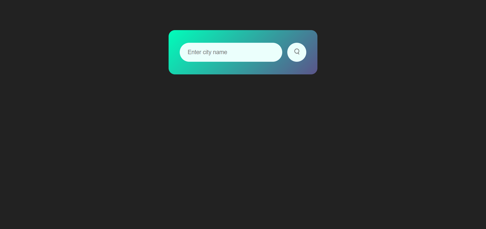
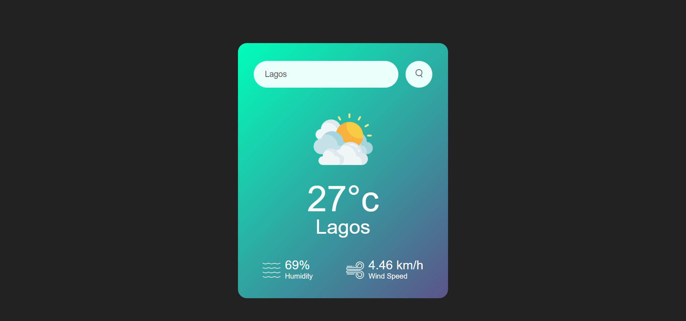

---

# ☁️ Weather App

A simple, responsive web application that fetches real-time weather data for any city in the world using the OpenWeatherMap API.

## 📖 Overview

This project allows users to search for a city and instantly view current weather conditions. It handles data fetching asynchronously and updates the DOM with the temperature, humidity, wind speed, and dynamic weather icons (Clouds, Rain, Clear, etc.) based on the API response.

## 📸 Screenshots



## ✨ Features

* **Real-Time Data:** Fetches live weather information via the OpenWeatherMap API.
* **Dynamic UI:** The weather icon updates automatically based on the condition (e.g., displaying a rain icon if the API returns "Rain").
* **Error Handling:** Displays a user-friendly "Invalid City Name" error message if the location is not found (404 status).
* **Responsive Design:** Optimized for different screen sizes.

## 🛠️ Tech Stack

* **Frontend:** HTML5, CSS3
* **Scripting:** Vanilla JavaScript (ES6+ with `async/await`)
* **API:** [OpenWeatherMap Current Weather Data](https://openweathermap.org/current)

## 🚀 Installation & Setup

To run this project, you need your own API Key from OpenWeatherMap.

1. **Clone the repository:**
```bash
git clone https://github.com/Otormin/WeatherApp.git

```


2. **Get an API Key:**
* Sign up at [OpenWeatherMap.org](https://home.openweathermap.org/users/sign_up).
* Navigate to "My API Keys" and copy your key.


3. **Configure the App:**
* Open the `script.js` file.
* Paste your key into the `apiKey` variable at the top:
```javascript
const apiKey = "YOUR_OPENWEATHER_API_KEY_HERE";

```


4. **Run:**
Open `index.html` in your browser.

## 📂 Code Logic

The core functionality relies on the `checkWeather()` function, which performs the following steps:

1. **Fetch:** Calls the API with the city name from the input field.
2. **Validate:** Checks `response.status`. If it is `404`, the error message block is displayed.
3. **Parse & Update:** If successful, it parses the JSON data and updates the HTML elements (`.temp`, `.humidity`, `.wind`).
4. **Icon Selection:** A conditional block checks `data.weather[0].main` to assign the correct image source (e.g., `images/rain.png`).

```javascript
if(data.weather[0].main == "Clouds"){
    weatherIcon.src = "images/clouds.png"
}
// ... checks for Rain, Clear, Drizzle, Mist ...

```